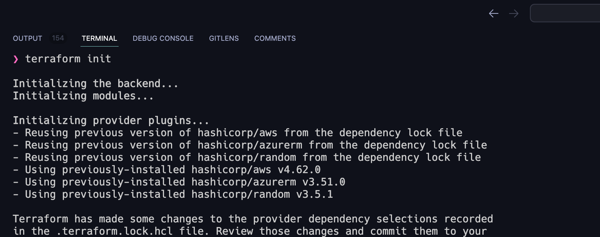
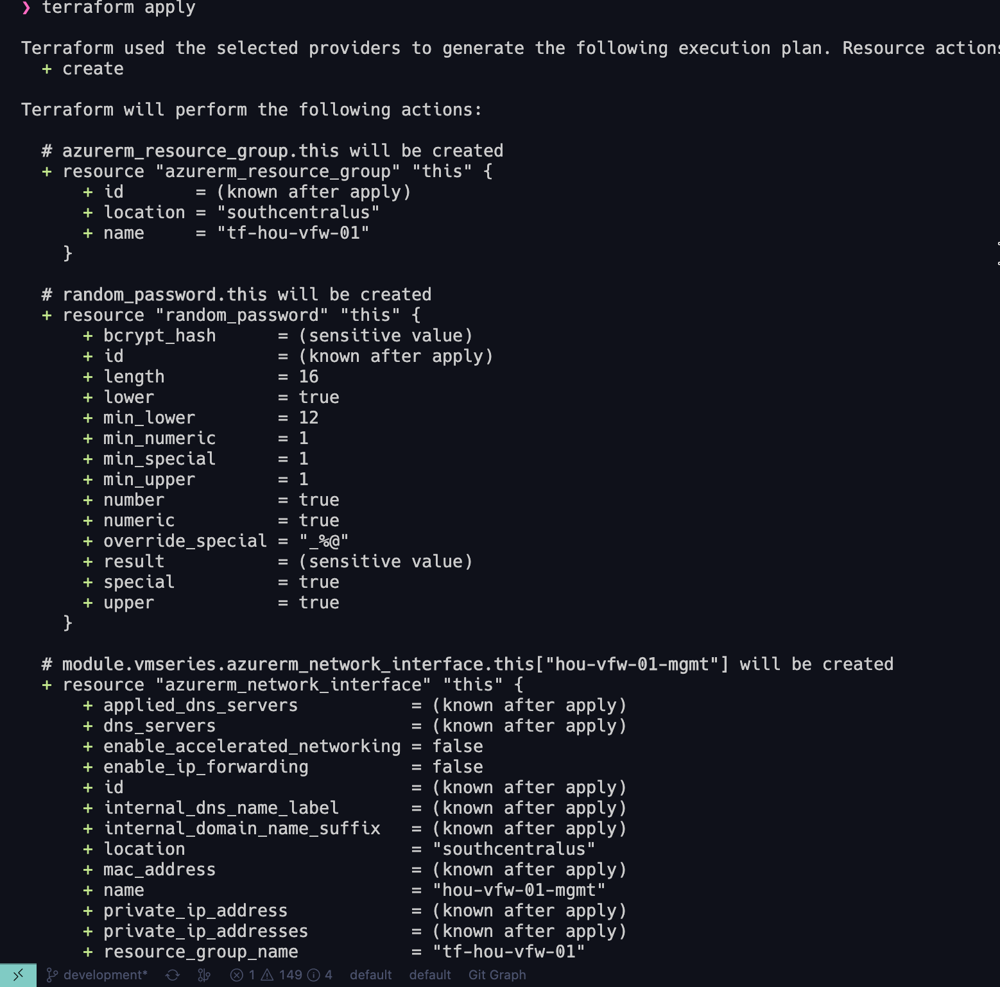
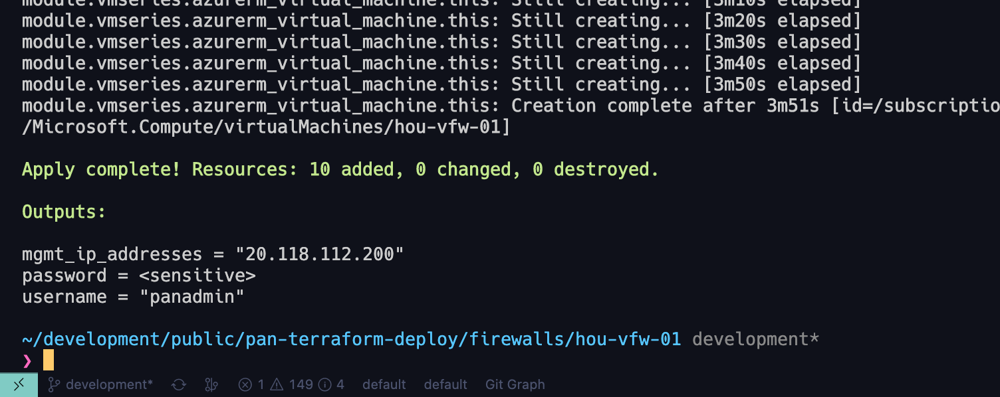

# Deploy Palo Alto Networks VM-Series with Terraform

This is a project that uses Terraform to manage the lifecycle of VM-Series firewalls in Azure using infrastructure-as-code practices. 

## Table of Contents

- [Deploy Palo Alto Networks VM-Series with Terraform](#deploy-palo-alto-networks-vm-series-with-terraform)
  - [Table of Contents](#table-of-contents)
  - [Project Overview](#project-overview)
  - [Terraform Overview](#terraform-overview)
  - [Usage](#usage)
    - [Clone Repository](#clone-repository)
    - [Update tfvars File](#update-tfvars-file)
    - [Terraform Workspace Creation](#terraform-workspace-creation)
    - [Terraform Lifecycle Commands](#terraform-lifecycle-commands)
  - [📸 Screenshots](#-screenshots)
  - [🤝 Contributing](#-contributing)

## Project Overview

This project uses Terraform to manage the lifecycle of VM-Series firewalls in Azure using infrastructure-as-code practices. The project is designed to be a starting point for users to build upon and customize to their specific needs.

This project is effectively a clone of the [Terraform Modules for Palo Alto Networks VM-Series on Azure Cloud](https://github.com/PaloAltoNetworks/terraform-azurerm-vmseries-modules) with the following modifications:

- nested firewalls under a `firewalls/` directory
- remove Makefiles
- added `up.sh` script to check for status code of 200 to be returned from the management IP before continuing.

## Terraform Overview

[Terraform](https://www.terraform.io/) is an open-source infrastructure-as-code software tool created by HashiCorp. It enables users to define and provide data center infrastructure using a declarative configuration language. Terraform supports a wide variety of cloud providers and services, making it easy to manage multi-cloud environments.

## Usage

### Clone Repository

To get started, clone this repository to your local machine:

```bash
git clone https://github.com/cdot65/pan-terraform-deploy.git
cd pan-terraform-deploy
```

### Update tfvars File

Update the terraform.tfvars file with your specific project settings, such as provider credentials and resource configurations. Be sure to reference the available variables in the variables.tf file.

### Terraform Workspace Creation

Move into the `firewalls/` directory:

```bash
cd firewalls/
```

Move into the directory containing the firewall you'd like to manage, in my case that's `hou-vfw-01/`:

```bash
cd hou-vfw-01/
```

Create a new Terraform workspace to manage the state of your infrastructure:

```bash
terraform workspace new hou-vfw-01
```

Replace `hou-vfw-01` with a name for your workspace.

### Terraform Lifecycle Commands

Initialize your Terraform working directory:

```bash
terraform init
```

Create an execution plan to preview the changes that will be made to your infrastructure:

```bash
terraform plan
```

Apply the changes to your infrastructure:

```bash
terraform apply
```

Destroy the infrastructure when it is no longer needed:

```bash
terraform destroy
```

## 📸 Screenshots

`terraform init`



`terraform apply`



completed




## 🤝 Contributing

Contributions are always welcome! If you have any ideas, suggestions, or bug reports, feel free to submit a pull request or open an issue. Please read CONTRIBUTING.md for details on our code of conduct and the process for submitting pull requests to the project.
